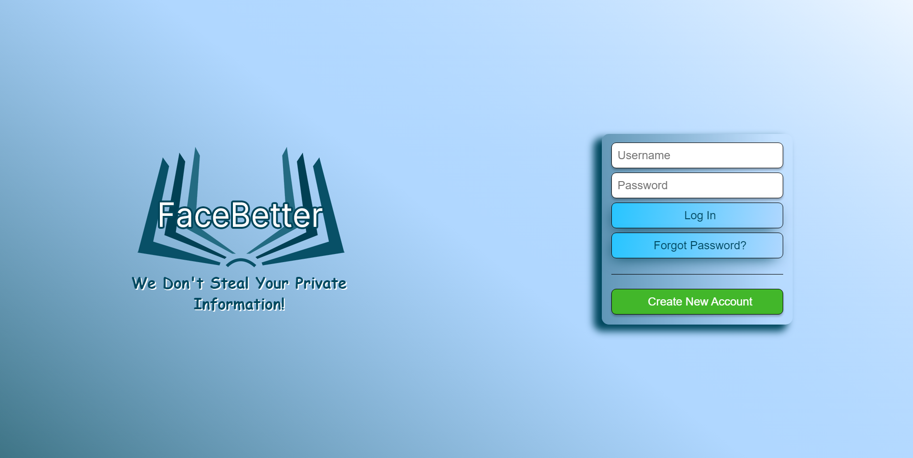
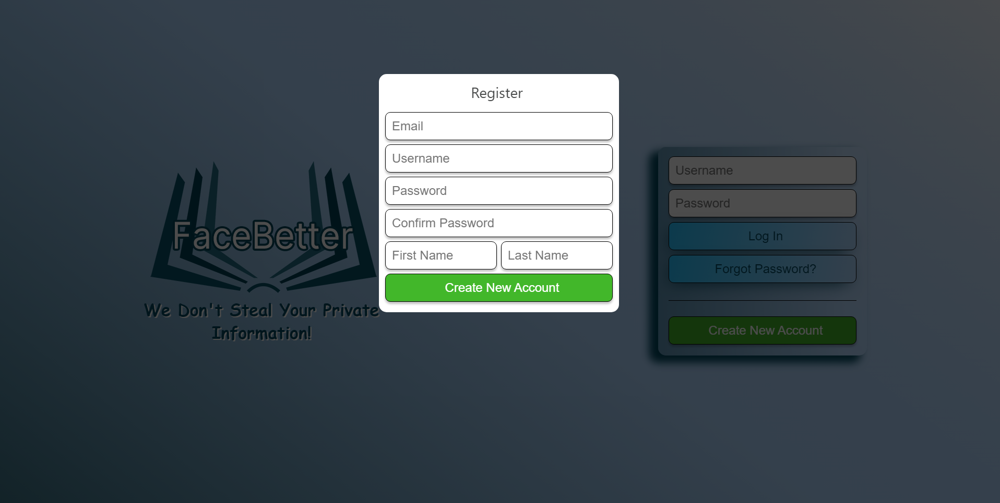
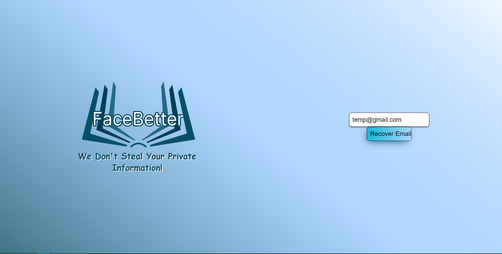
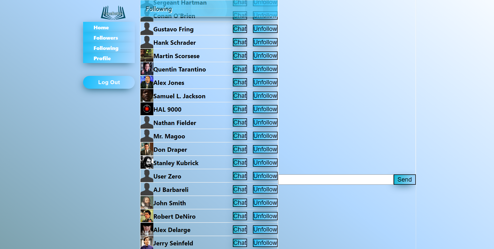
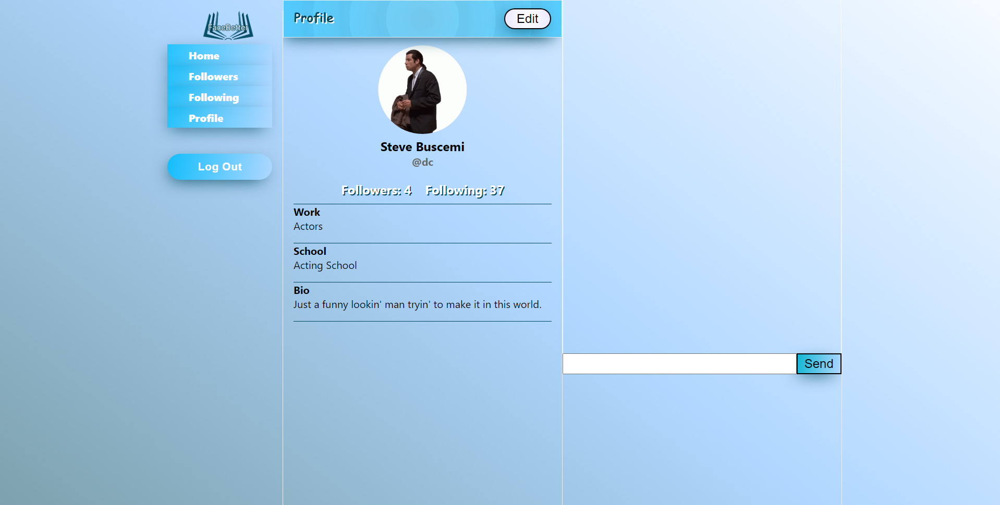
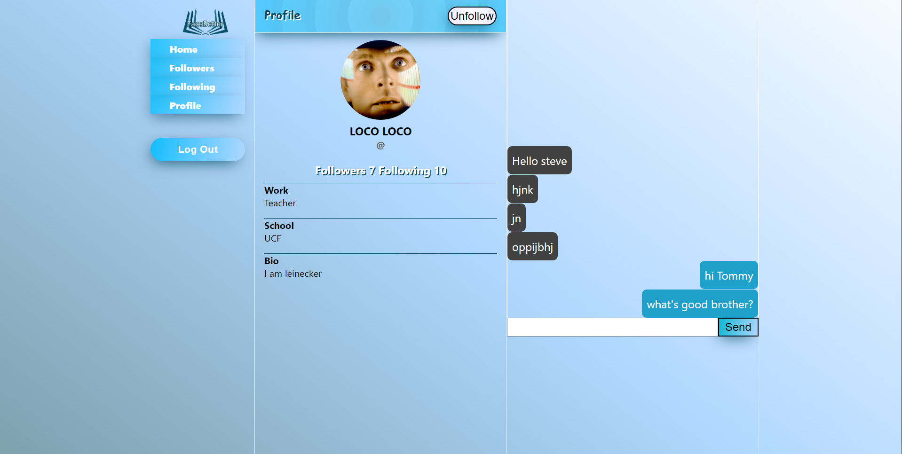

# Facebetter Web Side/Server
## A MERN Stack Social Media Application

Facebetter is a MERN stack social media application complete with the ability to follow accounts and chat functionality to communicate live with said accounts.
Other features include email verification, email recovery, md4 password hashing, and API endpoint support for group chats. There is also a mobile version with the
repo linked below.

### Project Team:
  * Guraashish Kainth: Project Manager
  * Dennis Cepero: Database/Support
  * Kierstin Roan: Database/Support
  * Connor Bramham: API
  * AJ Futo: API
  * Luke Wittmayer: Website
  * Oswaldo Gutierrez: Website
  * Gianmarco Folchi: Mobile Application
  * Nicolas Milescu-Brahmbhatt: Mobile Application
  
### [Mobile Application Repo](https://github.com/ReeCocho/facebetter-app)

## Website Screenshots

  
  <b>Login Page<b />
  
  
  <b>Register Page<b />

  
  <b>Account Recovery Page<b />

  
  <b>Main Page<b /> 

  
  <b>Profile Page<b />

  
  <b>Chat Page<b />
  

